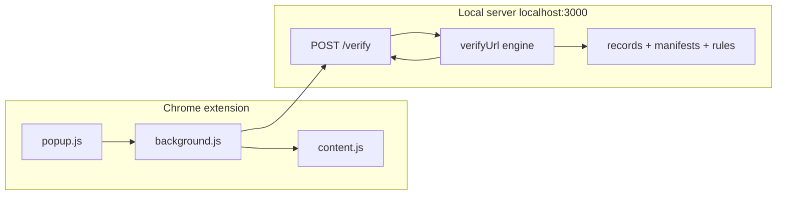

# AP Trust 2.0 — Developer guide

This document explains how **APTrust2.0** is implemented: architecture, trust logic, unique features, and where to find the code. It is written for engineers who need to **defend or extend** the POC.

**Repository:** [github.com/Anush-Prabhu/APTrust2.0](https://github.com/Anush-Prabhu/APTrust2.0)

---

## 1. What this project is

AP Trust 2.0 is a **local proof-of-concept**: a Node/Express TypeScript server plus a Chrome Extension (Manifest V3). Organizations declare trust in **per-domain JSON-LD manifests** under `data/manifests/`. The **rule engine** evaluates whether a URL (or derived URL from an email/handle) is **inside or outside** the selected **trust boundary**.

**Important:** Truth is **whatever you put on disk**. There is no live DNS, CT logs, or remote manifest registry. The logic is **real**; the **ground truth is authored data** (appropriate for demos and lab work).

---

## 2. Repository layout

| Path | Role |
|------|------|
| `data/records.json` | Registry of trust boundaries (`canonicalDomain`, `manifestKey`, `policy`, `aliases`, `status`). |
| `data/manifests/<domain>.json` | One JSON-LD manifest per org (schema.org + `aptrust:` vocabulary). |
| `data/rules.json` | Feature flags / priority metadata for engine steps (enable/disable rules). |
| `server/src/engine/engine.ts` | Main `verifyUrl()` pipeline (ordered steps). |
| `server/src/engine/relationships.ts` | Bidirectional checks, owned host sets, unidirectional claim detection. |
| `server/src/engine/explanations.ts` | Dynamic fraud reasons + cross-manifest drift lint. |
| `server/src/engine/lookalike.ts` | Heuristic lookalike detection (edit distance, punycode, keywords). |
| `server/src/normalize.ts` | URL normalization, subdomain helpers, social path matching. |
| `server/src/data.ts` | Load/save JSON; **coerce JSON-LD → internal `Manifest` shape**. |
| `server/src/routes/public.ts` | `/health`, `/search`, `/manifest/:domain`, `/verify`, `/report`. |
| `server/src/routes/admin.ts` | Admin API + `GET /admin/manifest-consistency`. |
| `extension/` | MV3 popup, background service worker, content script (banner, report modal). |
| `docs/architecture.md` | Shorter module / rule-order reference. |
| `aptrust_local_verification_poc_srs.md` | Original SRS. |

---

## 3. High-level request flow



1. User selects a **boundary** (e.g. `jhu.edu` or demo impostor `jhuu.com`).
2. Extension calls **`POST /verify`** with `{ boundary, url }`.
3. Server loads **`records.json`**, the boundary’s manifest, all manifests needed for graph checks, and **`rules.json`**.
4. **`verifyUrl`** runs steps in strict priority order (see §5).
5. Response includes **`status`**, **`relationship`**, **`reasons[]`**, and optionally **`warnings[]`** (drift advisories).

---

## 4. Bidirectional verification (the question everyone asks)

**Q:** If I select `jhuu.com` and the fake manifest *claims* affiliation with `jhu.edu`, does the code **actually** read **both** manifests?

**A:** Yes.

### 4.1 Finding one-way claims

`findUnidirectionalClaims` walks the **selected boundary’s** manifest:

- `relatedOrganizations[].canonicalDomain`
- `claimedExternalDomains[]` (URL → host → `findRecordByDomain`)
- `parentOrganization.canonicalDomain`

For each distinct **counterparty record** found, it loads **`manifests[counterparty.manifestKey]`** and calls **`manifestDeclaresBoundary(claimedManifest, boundary.canonicalDomain)`**. If that returns **false**, the pair is stored as an **unreciprocated claim**.

```132:158:server/src/engine/relationships.ts
export function findUnidirectionalClaims(
  boundary: RecordEntry,
  boundaryManifest: Manifest,
  records: RecordEntry[],
  manifests: ManifestMap,
): UnidirectionalClaim[] {
  const claims: UnidirectionalClaim[] = [];
  const seen = new Set<string>();

  const considerCandidate = (canonicalDomain: string | undefined): void => {
    // ...
    const claimedManifest = manifests[claimed.manifestKey];
    if (manifestDeclaresBoundary(claimedManifest, boundary.canonicalDomain)) {
      return; // reciprocal — not suspicious
    }
    claims.push({
      claimedRecord: claimed,
      // ...
      claimedRecordHosts: claimedRecordOwnedHosts(claimed, claimedManifest),
    });
  };
  // ... iterates relatedOrganizations, claimedExternalDomains, parentOrganization
}
```

### 4.2 What “reciprocate” means

`manifestDeclaresBoundary(subject, boundary)` is **true** only if **`subject`’s manifest** lists **`boundary`** in one of:

- `parentOrganization.canonicalDomain`
- `relatedOrganizations` (canonical match **or** `domains[]` URL host match)
- `officialDomains` host match

```72:101:server/src/engine/relationships.ts
export function manifestDeclaresBoundary(
  subject: Manifest | undefined,
  boundary: string,
): boolean {
  if (!subject || !boundary) return false;
  const target = stripWww(boundary.toLowerCase());

  if (subject.parentOrganization) {
    if (
      stripWww(subject.parentOrganization.canonicalDomain.toLowerCase()) ===
      target
    ) {
      return true;
    }
  }

  for (const ro of subject.relatedOrganizations || []) {
    if (stripWww(ro.canonicalDomain.toLowerCase()) === target) return true;
    for (const d of ro.domains || []) {
      const h = getHostFromUrl(d);
      if (h && hostMatches(h, boundary)) return true;
    }
  }

  for (const d of subject.officialDomains || []) {
    const h = getHostFromUrl(d);
    if (h && hostMatches(h, boundary)) return true;
  }

  return false;
}
```

So **`jhu.edu`’s manifest must literally mention `jhuu.com`** (or a URL whose host matches it) in those fields. The seed `jhu.edu` manifest does **not** — hence **`SUSPICIOUS_UNIDIRECTIONAL_CLAIM`** when the URL host falls under `jhu.edu`’s owned scope.

### 4.3 When the verdict fires

Step 5 of the engine intersects **unidirectional claims** with the **current URL host**: if the URL is the counterparty’s canonical domain, a subdomain of it, or under its **owned official hosts**, the request returns suspicion **before** generic OUT_OF_BOUNDARY.

```268:299:server/src/engine/engine.ts
  // Step 5: suspicious unidirectional claim detection.
  if (ruleEnabled(ctx.rules, 'UNIDIRECTIONAL_CLAIM_DETECTION')) {
    const claims = findUnidirectionalClaims(
      boundary,
      boundaryManifest,
      ctx.records,
      ctx.manifests,
    );
    for (const claim of claims) {
      const matchesClaimedRecord =
        hostMatches(targetHost, claim.claimedRecord.canonicalDomain) ||
        isSubdomainOf(targetHost, claim.claimedRecord.canonicalDomain) ||
        !!findHostScopeMatch(targetHost, claim.claimedRecordHosts);
      if (matchesClaimedRecord) {
        const claimedManifest = ctx.manifests[claim.claimedRecord.manifestKey];
        return {
          // ...
          status: 'SUSPICIOUS_UNIDIRECTIONAL_CLAIM',
          relationship: 'UNIDIRECTIONAL_CLAIM',
          reasons: explainUnidirectionalClaim({
            boundary,
            boundaryManifest,
            claimedRecord: claim.claimedRecord,
            claimedManifest,
            records: ctx.records,
          }),
        };
      }
    }
  }
```

---

## 5. Rule engine step order (`verifyUrl`)

The documented priority in `engine.ts` is:

1. Normalize URL; resolve boundary record and manifest.
2. Disabled boundary → `DISABLED_BOUNDARY`.
3. **`excludedDomains`** → `EXCLUDED` (deny list wins everything).
4. **Unidirectional claim** (Step 5 above) → `SUSPICIOUS_UNIDIRECTIONAL_CLAIM`.
5. **Lookalike** → `SUSPICIOUS_LOOKALIKE` (skips hosts already in declared relationship scope).
6. Exact canonical boundary host → `OFFICIAL` / `SELF_VERIFIED`.
7. **`officialDomains` + subdomain expansion** → `OFFICIAL`.
8. **Related org / parent org** (subdomain-aware) → `RELATED` (bidirectional vs one-way reflected in relationship + status code).
9. **`additionalProfiles`** (exact URL) → `OFFICIAL` / `ADDITIONAL_PROFILE_DECLARED`.
10. **`socialProfiles`** (exact or sub-path) → `SOCIAL_VERIFIED`.
11. **`officialMail`** (host + optional `realmHint`) → `OFFICIAL` / `OFFICIAL_MAIL_DECLARED`.
12. Default → `OUT_OF_BOUNDARY`.

After the inner result is built, **`attachDriftWarnings`** adds non-blocking **`warnings[]`** for graph drift involving the `(boundary, counterparty)` pair (see §7).

---

## 6. Unique features (POC highlights)

### 6.1 JSON-LD manifests with coercion

On-disk files use **`@context`**, **`@type`**, and **`aptrust:*`** keys (e.g. `aptrust:sameAsDomain`). `coerceManifest()` in `data.ts` maps those into the internal `Manifest` type the engine consumes. **`GET /manifest/:domain`** returns raw JSON-LD **plus** `_normalized` and **`_policy`** (trust root / acceptance mode from `records.json`).

### 6.2 Dynamic fraud explanations

`explainUnidirectionalClaim()` in `explanations.ts` builds **`reasons[]`** from:

- Which fields on the **impostor** manifest asserted the claim (`collectClaimPaths`).
- What was **scanned** on the **counterparty** manifest (`searchReciprocation` — parent, related org names, officialDomains counts).

Adding a new malicious manifest **does not require code changes** for the explanation text to stay accurate.

### 6.3 Cross-manifest drift lint

`findManifestDrift(records, manifests)` emits **`DriftFinding[]`** for every edge A→B where B does not declare A back. Surfaced via:

- **`GET /admin/manifest-consistency`**
- **`warnings[]` on `POST /verify`** when the verified URL resolves to a counterparty in a drifting pair with the selected boundary.

### 6.4 Subdomain vs social multi-tenant

`isSubdomainOf` and `findHostScopeMatch` expand trust for **owned** organizational hosts but **not** for known **social** hosts (e.g. only declared paths on `instagram.com` count). See `normalize.ts` (`SOCIAL_HOSTS`, `isSocialHost`).

### 6.5 Extension: APT 1.0 UX

- Toolbar badge: OK / ! / mail / excluded.
- Red page banner, report modal, link outlines, paste warnings.
- Popup: boundary search, current tab verdict, manual verify for **URL / email / @handle**.
- **Suspicious boundary card** uses **`collectImpersonationTargets`** in `background.js` to say *“claims to be X (domain)…”* from the live manifest.

### 6.6 Policy surface (documentation-first)

`RecordPolicy` may include **`trustRootCanonical`** and **`acceptWithinBoundary`**. The engine’s RELATED path already enforces reciprocity; these fields **document** intent for operators and the popup (`_policy` on `/manifest`).

---

## 7. Drift warnings on `/verify`

`verifyUrl` wraps the inner implementation and calls **`attachDriftWarnings`**:

- Resolves the URL’s host to a **counterparty `RecordEntry`** (direct match or parent labels).
- Runs **`findManifestDrift`** once, filters with **`findingsForPair(boundary, counterparty)`**.
- Appends **`{ kind: 'manifest_drift', detail, data }`** entries — **verdict `status` unchanged**.

---

## 8. Extension ↔ server contract

| Feature | Mechanism |
|---------|-----------|
| Search boundaries | `GET /search?q=` |
| Verify | `POST /verify` JSON `{ boundary, url }` |
| Manifest + policy | `GET /manifest/:domain` → JSON-LD + `_normalized` + `_policy` |
| Report | `POST /report` (mock; logs server-side) |
| Consistency audit | `GET /admin/manifest-consistency` |

`extension/src/config.js` sets **`serverBase`** (default `http://localhost:3000`).

---

## 9. Testing

```bash
npm test
```

Vitest covers normalization, the full engine table, HTTP routes, admin saves, **dynamic unidirectional explanations**, **drift detection**, and **manifest-consistency** endpoint. Tests use **`APTRUST_DATA_DIR`** to point at a temp copy of `data/` so seed files are never mutated.

Key file: `server/src/__tests__/explanations.test.ts`.

---

## 10. How to explain this to stakeholders

**One sentence:**  
*“The extension asks our local server whether a URL fits the org’s declared graph; the server loads **both** manifests when needed and only treats cross-org trust as solid when **each side’s JSON declares the other** in the allowed fields — otherwise we flag one-way impersonation claims and explain exactly which manifest field lied.”*

**POC caveat:**  
*“The manifests are files we ship in the repo, not Johns Hopkins’ production attestations.”*

---

## 11. Further reading

- [README.md](../README.md) — quick start, endpoints, feature list.
- [architecture.md](./architecture.md) — module map / rule order.
- [demo-script.md](./demo-script.md) — scripted walkthrough.
- [future-production-roadmap.md](./future-production-roadmap.md) — hardening ideas.
- [aptrust_local_verification_poc_srs.md](../aptrust_local_verification_poc_srs.md) — original SRS.
